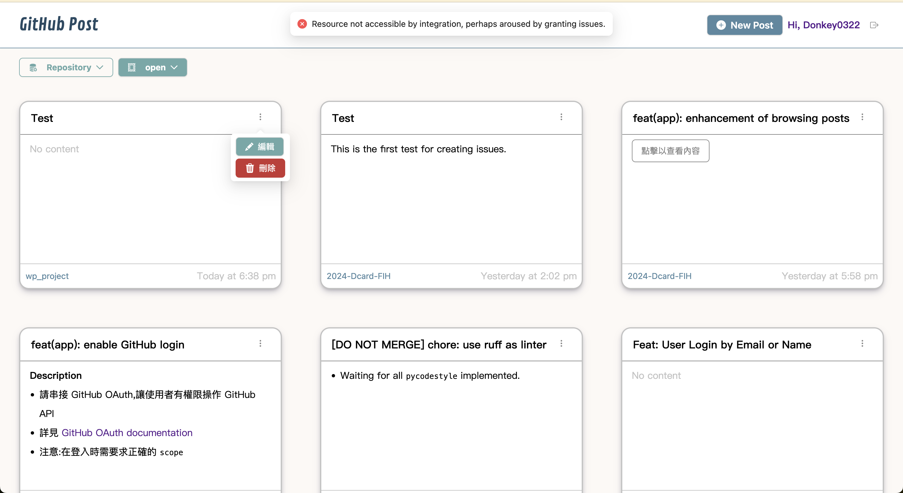

# Overview

> This is a entry assignment of 2024 Dcard Frontend Intern. Served in [here](https://2024-dcard-fih.vercel.app)!!!

[![Next][Next.js]][Next-url]

## Features & Requirements

- Github login

  Users need to login with Github account to access the service provided. After logging you can start managing you issues on both private and public repos of your own.

  > [!IMPORTANT]  
  > The login state depends on the browser's Github login state, so if you want to change the account authorized, you need first to log out your account in Github or change another browser.

- Post Management

  This is the list of all issues you have, including your private/public repos' issues, organization's issues, and collaborator's issue. You can see a body preview if the body is simple, while the longer body would be shown in the click-pop-out detailed modal.

  - Pagination & Filter

    The pagination and filter are managed based on the routing, so you have to notice the url about what pages or filter are applied.

    > [!TIP]  
    > The handler of routing sometimes lags for about 500 millisecond, so the pop-out and vanish might take some responsive time.

  - Edit, Delete, Create

    The operation menu offers a shortcut for **edit mode** and interface to **remove post** (close issues); however if the issue is a pull request, which according to [Github doc](https://docs.github.com/en/rest/issues/issues?apiVersion=2022-11-28#list-issues-assigned-to-the-authenticated-user) serves as an issue, it only can be read, without editing, closing, and reopening, where there will be a tooltip reminder.

    Creating Post is required to choose a targeted repo, enter title and body to submit.

- Post Interface

  In the detailed post page you can scan, edit and preview the edited posts. The validation for required title and over-30-word body is applied.

- Enhancement

  - Error handling

    I noticed that Github RestAPI has various and diverse usages about issues. Errors may occur when you edit or delete issues that do not belong to the repos you own (perhaps others' repos or organizations' repos). For not figuring out the root cause, I temporarily use error message for this problem.

    

## Development

The project is using [pnpm](https://pnpm.io/) as npm client.

Install modules:

```sh
pnpm install
```

Run the application in dev server:

```sh
pnpm dev
```

Run script for commit

```sh
pnpm commit
```

## Tech

### File Structure

- **`envs/`** defines the customed public environment variables for different environment, but for this project it doens't come in handy. Other sensitive variables are stored in github and vercel.

- **`scripts/`** stores scripts like commit alignment and server starter.

- **`src`**

  `src` serves the main project, where `app` is reserved in [next doc](https://nextjs.org/docs/app/building-your-application/routing#the-app-router), `assets` for icons and images, `components` for shared general components, `constants` for constants, `hooks` for sharing logic of [customed hooks](https://react.dev/learn/reusing-logic-with-custom-hooks), `libs` for library extension, `providers` for whole project provider, `services` for api fetching, `utils` for functions commonly used.

  `modules` are the main features of the project, which also contains folders above, each for the more specific usage aimed at respective features.

### Linter

> Using [husky](https://typicode.github.io/husky/) + eslint for linter and styling

### Github Action & Vercel

The project use github action to deploy on [Vercel](https://vercel.com/docs).

- **preview**:

  Every pull request (except from develop) will generate an preview domain aiming the original branch version, which enables testers or author to check differences between local end and remote end.

- **staging**:

  When merging into `develop`, a new version will be deployed onto staging domain, which is also a preview for vercel, while at last pointed to a fixed staging domain for QA.

- [**production**](https://2024-dcard-fih.vercel.app/):

  When QA has no problems with the staging version, a pull request from `develop` to `master` will be lauched, and once merged the production version is on!

<!-- MARKDOWN LINKS & IMAGES -->
<!-- https://www.markdownguide.org/basic-syntax/#reference-style-links -->

[Next.js]: https://img.shields.io/badge/next.js-000000?style=for-the-badge&logo=nextdotjs&logoColor=white
[Next-url]: https://nextjs.org/
